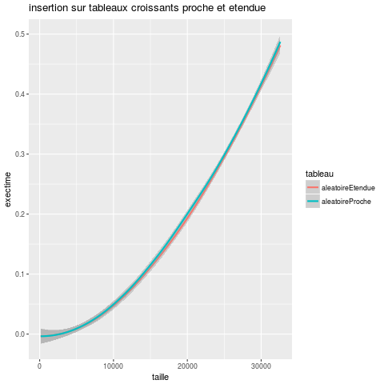

### Compte rendu P4z

## Application

Nous testons 3 algorithmes de tri différents :

* Tri insertion
* Tri Fusion
* Tri rapide

## Environnement de test

Laptop Asus Intel Core i7-5500U CPU @ `2.40Ghz` x 4


## Méthode de test

Nous utilisons un script qui permet d'automatiser les tests. Le script produit
un fichier de données variant selon les paramètres données au script.
Les paramètres étant les fonctions voulant êtres testées, le nombre de tests
et le ou les executables voulant être executés. La taille du tableau est generée
de manière aléatoire dans le script.

## Préliminaires

La complexité est un champs d'études vaste et passionnant. Il peut-être étudié en philosophie, en biologie, en mathématiques, et bien-sûr en informatique. Elle confère des propriétés intéressantes, et surtout indispensables à tout programmeur soucieux de créer des programmes optimisés, efficaces et rapides. Dans cet article, nous offrons au lecteur un prélude à la complexité d'un point de vu mathématiques théorique. Puis, dans un second temps, nous nous concentrerons
sur la partie informatique pratique. Le plan en découle intrasèquement :

- Introduction
- Notation Big O et petit aparté mathématiques
- Temps d'exécution d'un programme
- Temps d'exécution d'une instruction et assembleur
- Notion de complexité
- Complexité en fonction de plusieurs variables
- Conclusion et ouverture vers d'autres possibilités

Il est usuel d'écrire des programmes sans étudier en amont et en omettant (souvent) volontairement certains paramètres pourtant essentiels à son fonctionnement :

- Le type et la fréquence du microprocesseur utilisé,
- Le langage utilisé et le compilateur choisi, ainsi que de ses réglages,
- Les données d'entrée,
- La complexité en temps de l'algorithme

Nous voilà maintenant fin prêt. C'est parti !

## Introduction

Un algorithme est une série d'opérations qui permet de fournir une solution à une problématique préalablement donnée.
Il est parfois fastidieux de trouver une solution. Mais il peut-être encore plus fastidieux de dénicher un algorithme qui fournit une solution rapidement.
Sur différent sites de challenge de programation, une limite de temps est imposée : la durée maximale autorisée d'exécution de votre programme. Si votre code ne satisfait pas une réponse dans cette limite pour un test donné, ce test est considéré comme étant un échec, même si avec plus de temps, votre programme aurait pu satisfaire une réponse juste. Toute la difficulté est donc de faire en sorte que votre programme soit suffisamment vif.


L'objectif de cet article sera d'estimer grossièrement la célérité d'un algorithme avant même de le lancer. Il s'agit du calcul de la complexité en temps d'un algorithme.
Nous travaillerons avec le langage C et le compilateur gcc.

gcc -s
Complexité dans le meilleur des cas
Complexité dans le pire des cas
Complexité dans un tableau dont les éléments ont été généré aléatoirement
Complexité sur de petits tableaux
Complexité sur un tableau partiellement trié

## Ligne de commande de compilation C/C++

`g++ -Wall -O2 -o output.exe tri.cpp`

Nous allons ici donner quelques conseils ou « tricks » propres au langage C ou C++ et leur compilateur associé gcc. Ce sont de bonnes pratiques à privilégier lorsque l'on travaille dans un environnement nécessitant rigueur et performance.
L'option `-Wall` du compilateur gcc active un maximum de warnings, ce qui permet de minorer le nombre de bugs potentiels. Il est plus que fortement déconseillé de travailler avec un code qui produit des warnings.
L'option `-O2` (c'est un 'O' et non un '0') permet un temps de compilation plus efficace ainsi qu'une génération de code plus performant. On peut gagner un facteur 2 ou 3 en vitesse dans certain cas.

## Mesurer le temps d'exécution

Sous environnement Linux, pour jauger le temps d'exécution d'un programme on utilisera la commande `time` suivante :
**time monprogramme.out**

Cette commande affichera les trois lignes suivantes :

```shell
real 0m0.572s
user 0m0.404s
sys  0m0.666s
```

- Le temps `real` correspond au temps qui s'est consumé, depuis le début et la fin de l'exécution d'un programme. Il est assujeti à de nombreux facteurs externes tels que par exemple les programmes extrinsèques exécutés au même moment par la machine.

- Le temps `user` cadre avec le temps que le processeur a passé à exécuter les instructions d'un programme, sans compter les appels systèmes tels que malloc, printf, scanf etc.

- Le temps `sys` cadre avec le temps que le processeur a passé à exécuter les appels systèmes, autrement dit il s'agit du temps utilisé par des fonctions systèmes comme malloc, printf ou scanf.

Celui qui nous intéresse dépend des besoin et du contexte. Souvent on ne porte attention que sur le temps "user" ou le total du temps "user" et "sys".

## [Unix] Vérification de la mémoire utilisée

Linux, encore une fois propose une commande bien utile. Il s'agit de la commande base "ulimit" qui permet de fixer une limite pour certaines ressources. Ces limites seront appliquées à tout programme lancé à partir de ce shell.

Pour fixer une limite globale à l'utilisation de la mémoire :

- `ulimit -v taille_memoire`

où taille_memoire est une valeur en kilo-octets. Par exemple pour limiter à 16 Mo :

- `ulimit -v 16000`

Une erreur sera affichée si la mémoire du programme est insuffisante. On peut en effet se retrouver face à une erreur d'allocation, ou de segmentation.
Une autre option de ulimit `-s` consiste à fixer une limite pour la taille de la pile. Très utile lorsque le champs d'application du programme se concentre sur la récursivité.

- `ulimit -s taille_pile`

où taille_pile est en kilo-octets.
Enfin, l'option `-a` nous permet d'afficher toutes les limites qu'il est possible de fixer.

## Utilisation de 'diff' pour comparer des résultats

Encore une commande Linux qui nous sera très utile, il s'agit de `diff` :
En effet, le potentiel de `diff` se révelera lorsque l'on voudra comparer les résultats de deux algorithmes différents.
La commande ci-dessous affichera toutes les différences trouvées entre le fichier1 et le fichier2 :

- diff fichier1 fichier2

L'option `-q` de diff permet de cacher les différences, et nous indique seulement par un booléen si deux fichiers sont différents :

- diff -q fichier1 fichier2


L'option `-w` nous permet d'ignorer les différents qui sont des caractères d'espacement comme ' ', '\t', '\n' :

- diff -w fichier1 fichier2


On peut alors tester si les résultats générés par un programme correspondent bien aux résultats attendus. La commande suivante en découle tout naturellement :

- diff -q -w sortie_attendue votre_sortie


## Etude de cas

### Problématique : La distance entre deux éléments adjacent interfère t-elle dans le temps d'exécution du tri ?

Nous avons un tableaux contenant des éléments de type long long unsigned int. La distance entre chaque élement adjacent est petite. Par exemple, nous avons : [0,1,0,1,0,1]. Nous avons maintenant un autre tableau, de même taille et la distance entre chaque élément est significative : [1, 1000000000, 1, 1000000000, 1, 1000000000].
La dernière étape est de trier ces deux tableaux avec le tri par insertion, le tri fusion ou le tri rapide au choix.

Est-il possible que le temps d'éxecution soit plus important pour le second tableau ?

### Eléments de réponse

Les algorithmes de tris tels que le tri par insertion, le tri rapide et le tri fusion sont appelés tris de comparaisons car ils trient les éléments sur leur ordre relatif par rapport aux autres éléments. Pas sur leur valeurs absolues. Du point de vu du tri rapide, tri fusion, ou du tri insertion les tableaux suivant sont parfaitement identiques :

[0, 1, 0, 1, 0] et [0, 1000000, 0, 1000000, 0].

En effet, il n'y a aucun moyen de savoir que 1000000 "est plus grand" que 1. Le nombre total d'opérations effectuées pour trier ces tableaux seront parfaitement identiques d'un tableau à l'autre. En fait, si l'on trie chacun de ces tableaux avec ces algorithmes de tri.
En fait, si l'on trie chaque tableau avec ces algorithmes et que l'on regarde les éléments se déplacer, on observera que les mouvements exécutés sont les mêmes.

Si l'on se place dans le contexte de trier des entiers qui correspondent à un seul mot machine, alors le coût d'un déplacement est indépendant de la valeur numérique stockée dans ce mot machine. Le coût de comparaison de ces éléments est probablement aussi le même. Il n'y a donc absolument aucune différence dans le temps nécessaire pour trier ces tableaux avec ces algorithmes. En témoigne la figure suivante :




S'il y a une différence, cela signifie que le processeur que vous utilisez peut comparer ou déplacer des nombres de tailles différentes dans des quantités de temps différentes. Pour autant que je sache, il n'existe pas d'architectures de processeurs qui le fassent.

Cependant, les algorithmes de tri comme le tri de comptage (counting sort) ou le tri par base (tri radix), qui n'appartiennent pas à la famille des tris de comparaison et dépendent de la taille des entiers que l'on traite. Ce dernier pourrait prendre plus de temps pour trier ces tableaux car ils travaillent soit un chiffre à la fois ou en les distribuant dans un tableau dont la taille dépend de la taille des nombres en questions. Dans ces cas, il est possible d'observer une différence entre les temps d'exécutions, à condition que l'algorithme employé ait bien été mis en œuvre.


## Résultats et analyses

Pour commencer, nous avons testé le temps d'exécution des 3 tris sur un tableau de valeurs générées aléatoirement et de type "long long unsigned int"
de taille variable.


On remarque que le temps d'exécution du tri par insertion augmente proportionnellement
à la taille du tableau tandis que le temps d'execution des 2 autres tri est constant et très faible.


 Néanmoins on peut voir que le tri fusion est celui qui utilise le plus de mémoire probablement à cause de la génération des sous tableaux puis de leurs fusions.
 En effet, le tri fusion étant implémenté de manière récursive, il sollicite énormément la pile.


Cette fois ci on analyse le temps d'éxecution pour des tableaux qui ont des valeurs triées par ordre croissant.
On constate que le temps d'éxecution du tri rapide augmente proportionellement pour des tableaux triées par ordre croissant. Le tri rapide n'est donc pas efficace pour des tableaux triés par ordre croissant.


Jetons un coup d'oeil à la consommation de mémoire pour voir si elle aussi a augmenté pour le tri rapide.


On voit que le tri rapide est celui qui utilise le plus de mémoire pour un tableau composé de valeurs croissantes.Le pivot étant le dernier élément du tableaux. Dans le cas du tableau croissant le pivot sera toujours l'élement le plus grand du sous tableau.

### Option -O2

Comme expliqué precedemment l'option -O permettrait de gagner du temps d'execution/compilation/ ou de réduire l'utilisation de mémoire. On peut voir les différents **flags** d'optimisation :


Nous allons tester le flag -O2 pour voir si nous le temps d'éxecution est réduit et si oui si la réduction du temps d'execution est vraiment notable. Nous avons donc génerer 2 executables l'un avec
le flag d'optimisation l'autre non. Nous avons choisi de tester le flag sur le tri insertion dans le pire et meilleur des cas, c'est à dire pour un tableau trié croissant et un tableau trié décroissants, résultat :

**Tableau decroissant - pire des cas** | **Tableau croissant - meilleur des cas** |
|---|---|---|---|---|
| |  |


On voit clairement que pour le pire des cas la différence est très importante, on peut aussi noter que la courbe du temps d'éxecution de l'executable optimisé augmente moins vite que l'executable non optimisé.
Pareil pour le meilleur des cas mais la différence est plus modérée, néanmoins le flag d'optimisation est très efficace et à ne pas négliger. Lorsque l'on utilise un flag d'optimisation il faut avoir un but précis, les flags optimise un aspect spécifique (temps d'éxecution / mémoire).

## Tri Insertion

**Complexité** | **Pire des cas** | **Moyen** | **Meilleur des cas** |
|---|---|---|---|---|
| **Notes** | Dans le pire cas, lorsque le tableau est trié à l'envers (tableau préalablement trié de manière décroissante), on obtient en sortie | | Lorsque le tableau est déjà triée, on obtient en sortie |
|**Courbes** |  |

Conclusion : Au cours de nos analyses et avec (un peu) l'aide du cours de M.ZIMMERMANN, on a pu remarquer une propriété intéressante du
tri insertion. En effet, son efficacité est meilleur que les deux autres algortithmes si le tableau initial possède un certain ordre.
L'algorithme tirera en effet parti de tout ordre partiel présent dans le tableau. Avec sa simplicité d'implantation,
cette propriété le promu tout naturellement pour "finir le travail" de méthodes plus lourdes comme le tri rapide ou le tri fusion.


## Tri Fusion

**Complexité** | **Pire des cas** | **Moyen** | **Meilleur des cas** |
|---|---|---|---|---|
| **Notes** | Dans le pire cas, lorsque le tableau est trié à l'envers (tableau préalablement trié de manière décroissante), on obtient en sortie | | Lorsque le tableau est déjà triée, on obtient en sortie |
|**Courbes** |  |


## Tri Rapide

**Complexité** | **Pire des cas** | **Moyen** | **Meilleur des cas** |
|---|---|---|---|---|
| **Notes** | Dans le pire cas, lorsque le tableau est trié à l'envers (tableau préalablement trié de manière décroissante), on obtient en sortie | | Lorsque le tableau est déjà triée, on obtient en sortie |
|**Courbes** |  |


## Ajouts possibles

Pour faciliter l'automatisation et la rapidité des tests nous aurions pu mettre en place un système d'arguments en ligne de commande pour selectionner le tri et le tableau voulant être testé. Nous n'avons pas eu le temps de comparer les différentes comparaisons et écritures. Tester d'autres algorithmes peut être interéssant (tri à bulles...). Nous avons mis en place 3 type de tableaux mais il aurait été possible de trouver d'autres types de tableaux plus particuliers.

Plan du futur compte rendu :

Introduction

Efficacité d'un programme

Nombre d'opérations d'un algorithme

Complexité d'un algorithme

Complexité et temps de calcul

Notation O()
Conclusion

## Conclusion Finale

Ce qu'il faut retenir ici, c'est qu'aucun des trois algortithmes n'est foncièrement meilleur qu'un autre. En effet, selon la situation,
la problèmatique, ou encore les enjeux derrière le programme, un des trois algorithmes sera à privilégier. Il faut alors avant de se
précipiter sur un algorithme de tri, étudier son comportement sous différents angles comme on l'a fait. Mon tableau d'entré est-il déjà trié
ou partiellement trié dans l'ordre croissant ? Est-il trié dans l'ordre décroissant ? Est-il trié aléatoirement ? Quelle taille  possède t-il ?
Combien de temps puis-je me permettre ? Et de mémoire ? Est-ce un petit tableau, un grand ou un moyen ? Dans ce cas, il faudra définir le
terme "grand", "petit" et moyen en fonction du contexte et de la problématique donnée !
