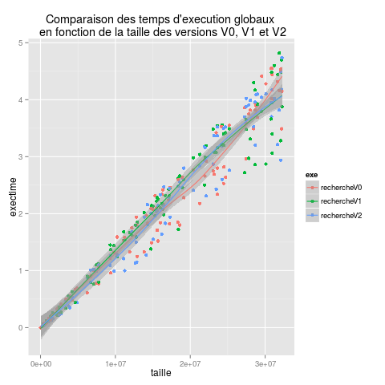

# P4z : Complexité et performances applicatives

## Procédure GIT

- Une seule personne par groupe de travail
	- Forke le dépôt depuis https://git.unistra.fr/gossa/P4z
	- Ajoute les membres de votre groupe de travail en tant que “Developer”
	- Ajoute votre tuteur enseignant en tant que “Reporter”

- Tous les membres 
	- clonent le dépôt forké 
	- ajoutent le dépôt prof comme dépôt distant : `git remote add prof git@git.unistra.fr:gossa/P4z.git`
	- travaillent normalement sur leur dépôt (sans faire de `git push prof`)

- En cas de mise à jour du dépôt initial (gossa/P4z)
	- Récupérer les modifications avec : `git pull prof`

## 101

Ce tutorial vise à illustrer l'utilisation d'un environnement GIT/gcc/R pour l'étude des performances d'un programme.

<<<<<<< HEAD
### Progression
=======
# Progression
>>>>>>> fe66181df32c6e1006e9bb44bb3d839450deb03d

En TD, nous avons vu les différentes étapes de l'étude :
- Analyse en boite noire : simple compilation sans regarder le code
- Analyse en boite grise : compilation avec `gcc -pg`, puis profilage avec `gprof`
- Analyse en boite blanche : modification du code pour suivre l'évolution des performances au fur et à mesure des modifications

<<<<<<< HEAD
### Analyse finale
=======
# Analyse finale
>>>>>>> fe66181df32c6e1006e9bb44bb3d839450deb03d

Le programme [recherche.c](101/recherche.c)
```
Recherche une valeur aléatoire dans un tableau d'entier aléatoire de taille n
Affiche le tableau et renvoie 1 si la valeur est trouvée, 0 sinon
Usage: ./recherche n
```

Le problème a donc un paramètre unique :
- taille du problème : n éléments

<<<<<<< HEAD
#### Dispositif expérimental

##### Production des données
=======
## Dispositif expérimental

### Production des données
>>>>>>> fe66181df32c6e1006e9bb44bb3d839450deb03d

```
gcc -pg recherche.c -o rechercheVx
./perf.sh | tee perf.dat
mkdir data
R --no-save -f script.R
```

<<<<<<< HEAD
##### Environnement de test

Laptop Vaio bi-cores Intel(R) Core(TM) i5-3230M CPU @ 2.60GHz avec hyperthread

#### Analyse en boite grise de la version initiale V0

##### Temps d'exécution global
=======
### Environnement de test

Laptop Vaio bi-cores Intel(R) Core(TM) i5-3230M CPU @ 2.60GHz avec hyperthread

## Analyse en boite grise de la version initiale V0

### Temps d'exécution global
>>>>>>> fe66181df32c6e1006e9bb44bb3d839450deb03d


On peut observer sur cette figuree une évolution presque parfaitement linéaire, avec cependant une légère augmentation de la dispersion avec l'augmentation de la taille du problème.

La régression linéaire indique un temps d'exécution constant (avec une taille nulle) nul, à quoi s'ajoute un facteur de 13e-6 s/élément.

Le temps d'exécution de l'application est donc relativement stable et linaire.

<<<<<<< HEAD
##### Consommation mémoire globale
=======
### Consommation mémoire globale
>>>>>>> fe66181df32c6e1006e9bb44bb3d839450deb03d


On peut observer sur cette figure une évolution parfaitement linéaire, sans aucune dispersion.

La régression linéaire indique une consommation mémoire constante de 1439 kilo-octets, à quoi s'ajoute un facteur d'environ 4 octets/élément, ce qui confirme que les éléments sont des entiers codés sur 4 octets.

La consommation mémoire est donc parfaitement stable, linéaire et cohérente.


<<<<<<< HEAD
##### Détail des temps d'exécution des fonctions internes
=======
### Détail des temps d'exécution des fonctions internes
>>>>>>> fe66181df32c6e1006e9bb44bb3d839450deb03d


On peut observer sur cette figure une évolution linéaire des temps d'exécution des trois fonctions du programme en fonction de la taille du problème. De plus, `afficher_tableau` et `generer_tableau` sont clairement plus lentes et instables que `rechercher`.

Les régressions linéaires indiquent des facteur d'environ 5e-6 s/élément pour `generer_tableau` et `afficher_tableau`, et de 3e-6 s/élément pour `rechercher`, ce qui est cohérent avec le facteur 13e-6 s/élement pour le temps d'exécution global.


<<<<<<< HEAD
#### Analyse en boite blanche et optimisation

Une analyse du code du programme permet de constater que la seule marge d'optimisation concerne la fonction `rechercher`. La suite se concentre donc dessus.

##### Optimation
=======
## Analyse en boite blanche et optimisation

Une analyse du code du programme permet de constater que la seule marge d'optimisation concerne la fonction `rechercher`. La suite se concentre donc dessus.

### Optimation
>>>>>>> fe66181df32c6e1006e9bb44bb3d839450deb03d

Nous allons maintenant comparet les versions V0 et V1 de la fonction `rechercher` : cda09f01e2fd5e4c1b36b2167ec7204b8eab1a7b...d7679b6cf4ee148bc834fe3853ee723c9ca1c15a


On peut observer sur cette figure une nette diminution des temps d'exécution de la fonction `rechercher` en version V1, accompagnée d'un très grande augmentation de l'instabilité, les temps d'execution pouvant n'être pas améliorés comme réduit à zéro. 

De plus, on constate une inflexion autour d'une taille de problème de 2e-7, qui peut aussi bien venir d'un artefact de la courbe de tendance que d'un phénomène réel.

Une étude du code permet d'identifier un paramètre constant `MAX_VALEUR` fixé à 1.5e-7, très proche du point d'inflexion. Il est donc possible qu'il en soit responsable. Il s'agit maintenant de vérifier cette hypothèse.

<<<<<<< HEAD
##### Vérification de l'hypothèse `MAX_VALEUR`
=======
### Vérification de l'hypothèse `MAX_VALEUR`
>>>>>>> fe66181df32c6e1006e9bb44bb3d839450deb03d

La version V2 correspond à une réudction sensible de la valeur de MAX_VALEUR d7679b6cf4ee148bc834fe3853ee723c9ca1c15a...72f7f47b5c9be8996d6cbfe9efd0fc9cd6f3c201 


On peut constater sur cette figure que la verion V2 réduit à néant les temps d'exécution de la fonction `rechercher`, ce qui confirme l'hypothèse de l'influence cruciale du paramètre `MAX_VALEUR`.

Cependant, il faut noter que la modification de ce paramètre ne modifie pas seulement les performances, mais aussi le comportement de l'application. Il doit donc être manipulé avec discernement.

Il s'agit maintenant de vérifier l'efficacité de cette optimisation sur les performances globales.

<<<<<<< HEAD
##### Evaluation des performances globales après optimisation
=======
### Evaluation des performances globales après optimisation
>>>>>>> fe66181df32c6e1006e9bb44bb3d839450deb03d



Cette figure permet d'observer que, comme l'analyse initiale de la distribution des temps d'exécution entre fonction le laissait penser, l'optimisation de la fonction `rechercher` n'a que peu d'influence sur les performances globales de l'application.

Les régressions linéaires des trois versions indiquent pour les versions V0, V1 et V2 des facteurs de respectivement 13.16e-06, 12.80e-6 et 13.14e-6 s/élément. On peut en conclure que le gain est négligeable, inférieur à la dispersion globale des performances.

<<<<<<< HEAD
#### Perspectives
=======
## Perspectives
>>>>>>> fe66181df32c6e1006e9bb44bb3d839450deb03d

Afin de pousser plus loin l'étude des performances de la fonction `rechercher`, nous pourrions étudier ses temps d'exécution en fonction de sa valeur retour. Pour aller encore plus loin, nous pourrions modifier cette valeur retour pour qu'elle soit l'index de la valeur trouvée plutôt qu'un booléen. Ceci permettrait de vérifier s'il existe une linéarité entre l'index et le temps d'exécution.


