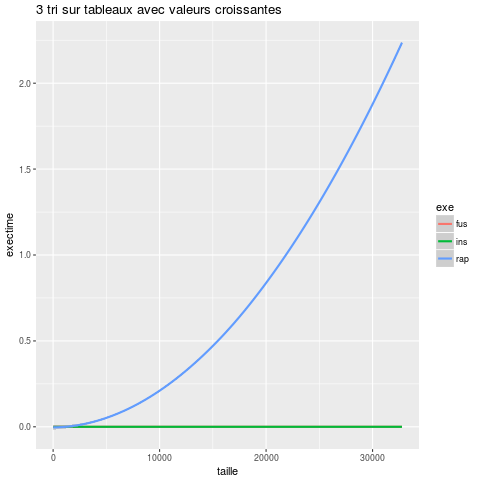
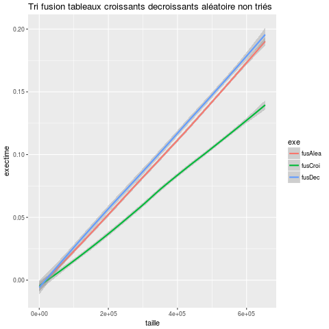

### Compte rendu P4z 

## Application

Nous testons 3 algorithmes de tri différents : 

* TriFusion
* Tri par insertion
* Tri rapide

## Environnement de test

Laptot Asus Intel Core i7-5500U CPU @ 2.40Ghz x 4

## Méthode de test

Nous utilisons un script qui permet d'automatiser les tests. Le script produit
un fichier de données variant selon les paramètres données au script.
Les paramètres étant les fonctions voulant êtres testées, le nombre de tests
et le ou les executables voulant être executés. La taille du tableau est generée 
de manière aléatoire dans le script.

## Résultats et analyses

Pour commencer, nous avons testé le temps d'exécution des 3 tris sur un tableau de valeurs générées aléatoirement et de type "long long unsigned int"
de taille variable.

On remarque que le temps d'exécution du tri par insertion augmente proportionnellement 
à la taille du tableau tandis que le temps d'execution des 2 autres tri est constant et très faible.

 Néanmoins on peut voir que le tri fusion est celui qui utilise le plus de mémoire probablement à cause de la génération des sous tableaux puis de leurs fusions.
 En effet, le tri fusion étant implémenté de manière récursive, il sollicite énormément la pile.

Cette fois ci on analyse le temps d'éxecution pour des tableaux qui ont des valeurs triées par ordre croissant.
On constate que le temps d'éxecution du tri rapide augmente proportionellement pour des tableaux triées par ordre croissant. Le tri rapide n'est donc pas efficace pour des tableaux triés par ordre croissant.

Jetons un coup d'oeil à la consommation de mémoire pour voir si elle aussi a augmenté pour le tri rapide.

On voit que le tri rapide est celui qui utilise le plus de mémoire pour un tableau composé de valeurs croissantes.Le pivot étant le dernier élément du tableaux. Dans le cas du tableau croissant le pivot sera toujours l'élement le plus grand du sous tableau. 

 
## Complexité dans le meilleur des cas - Tri Insertion
Lorsque le tableau est déjà triée, on obtient en sortie :

## Complexité dans le pire des cas - Tri Insertion
Dans le pire cas, lorsque le tableau est trié à l'envers (tableau préalablement trié de manière décroissante), on obtient en sortie :

## Complexité moyenne - Tri Insertion

Conclusion : Au cours de nos analyses et avec (un peu) l'aide du cours de M.ZIMMERMANN, on a pu remarquer une propriété intéressante du 
tri insertion. En effet, son efficacité est meilleur que les deux autres algortithmes si le tableau initial possède un certain ordre.
L'algorithme tirera en effet parti de tout ordre partiel présent dans le tableau. Avec sa simplicité d'implantation, 
cette propriété le promu tout naturellement pour "finir le travail" de méthodes plus lourdes comme le tri rapide ou le tri fusion.

## Complexité dans le meilleur des cas - Tri Fusion
Lorsque le tableau est déjà triée, on obtient en sortie :

## Complexité dans le pire des cas - Tri Fusion
Dans le pire cas, lorsque le tableau est trié à l'envers (tableau préalablement trié de manière décroissante), on obtient en sortie :

## Complexité moyenne - Tri Fusion
Lorsque le tableau est déjà triée, on obtient en sortie :

## Complexité dans le meilleur des cas - Tri Rapide

## Complexité dans le pire des cas - Tri Rapide
Dans le pire cas, lorsque le tableau est trié à l'envers (tableau préalablement trié de manière décroissante), on obtient en sortie :

## Complexité moyenne - Tri Rapide

Utilisation : `./a.exe -n fonction`

## Ajouts possibles 

Pour faciliter l'automatisation et la rapidité des tests nous aurions pu mettre en place un système d'arguments en ligne de commande pour selectionner le tri et le tableau voulant être testé. Nous n'avons pas eu le temps de comparer les différentes comparaisons et écritures. Tester d'autres algorithmes peut être interéssant (tri à bulles...). Nous avons mis en place 3 type de tableaux mais il aurait été possible de trouver d'autres types de tableaux plus particuliers.
Plan :

Introduction

Efficacité d'un programme

Nombre d'opérations d'un algorithme

Complexité d'un algorithme

Complexité et temps de calcul

Notation O()
Conclusion

## Conclusion Finale

Ce qu'il faut retenir ici, c'est qu'aucun des trois algortithmes n'est foncièrement meilleur qu'un autre. En effet, selon la situation, 
la problèmatique, ou encore les enjeux derrière le programme, un des trois algorithmes sera à privilégier. Il faut alors avant de se 
précipiter sur un algorithme de tri, étudier son comportement sous différents angles comme on l'a fait. Mon tableau d'entré est-il déjà trié
ou partiellement trié dans l'ordre croissant ? Est-il trié dans l'ordre décroissant ? Est-il trié aléatoirement ? Quelle taille  possède t-il ?
Combien de temps puis-je me permettre ? Et de mémoire ? Est-ce un petit tableau, un grand ou un moyen ? Dans ce cas, il faudra définir le
terme "grand", "petit" et moyen en fonction du contexte et de la problématique donnée !
