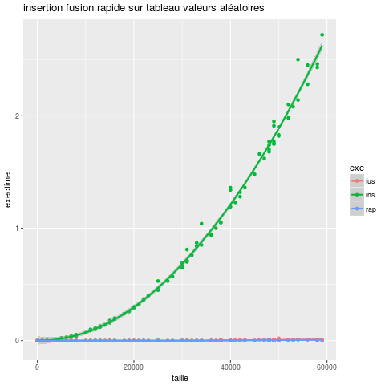

### Compte rendu P4z 

## Application

Nous testons 3 algorithmes de tri différents : 

* TriFusion
* Tri par insertion
* Tri rapide

## Environnement de test

Laptot Asus Intel Core i7-5500U CPU @ 2.40Ghz x 4

## Méthode de test

Nous utilisons un script qui permet d'automatiser les tests. Le script produit
un fichier de données variant selon les paramètres données au script.
Les paramètres étant les fonctions voulant êtres testées, le nombre de tests
et le ou les executables voulant être executés. La taille du tableau est generée 
de manière aléatoire dans le script.

## Résultats et analyses

Pour commencer, nous avons testé le temps d'exécution des 3 tris sur un tableau de valeurs générées aléatoirement et de type "long long unsigned int"
de taille variable.

On remarque que le temps d'exécution du tri par insertion augmente proportionnellement 
à la taille du tableau tandis que le temps d'execution des 2 autres tri est constant et très faible.

 Néanmoins on peut voir que le tri fusion est celui qui utilise le plus de mémoire probablement à cause de la génération des sous tableaux puis de leurs fusions.
 En effet, le tri fusion étant implémenté de manière récursive, il sollicite énormément la pile.

Cette fois ci on analyse le temps d'éxecution pour des tableaux qui ont des valeurs triées par ordre croissant.
On constate que le temps d'éxecution du tri rapide augmente proportionellement pour des tableaux triées par ordre croissant. Le tri rapide n'est donc pas efficace pour des tableaux triés par ordre croissant.

Jetons un coup d'oeil à la consommation de mémoire pour voir si elle aussi a augmenté pour le tri rapide.

On voit que le tri rapide est celui qui utilise le plus de mémoire pour un tableau composé de valeurs croissantes.
 
## Complexité dans le meilleur des cas - Tri Insertion

## Complexité dans le pire des cas - Tri Insertion

## Complexité moyenne - Tri Insertion

## Complexité dans le meilleur des cas - Tri Fusion

## Complexité dans le pire des cas - Tri Fusion

## Complexité moyenne - Tri Fusion

## Complexité dans le meilleur des cas - Tri Rapide

## Complexité dans le pire des cas - Tri Rapide

## Complexité moyenne - Tri Rapide

